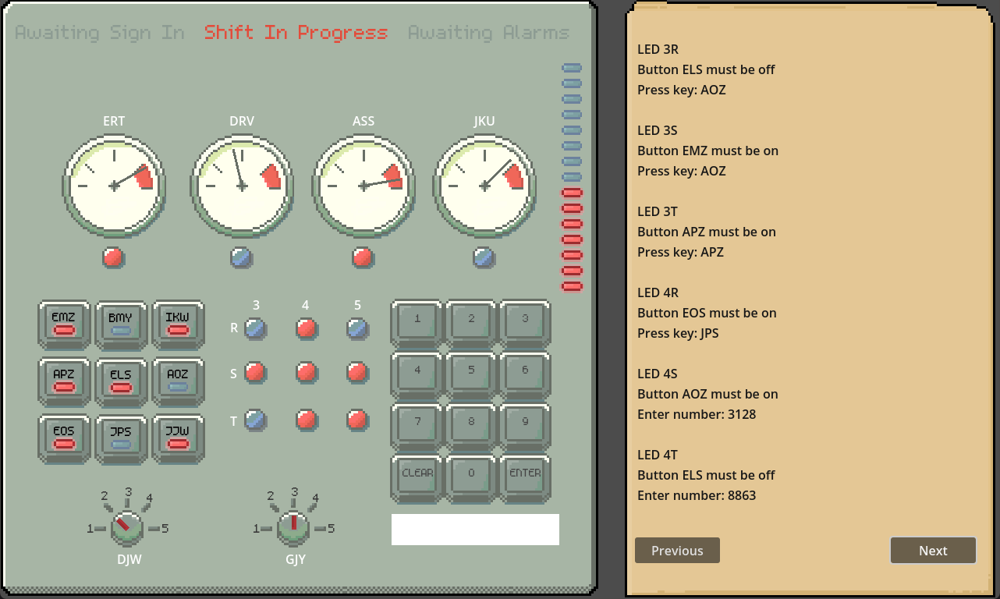

# RTFM

A Godot game created for the Godot Wild Jam #65 with theme "Overload".

https://rmp135.itch.io/rtfm

Disable the alarms by reading the manual and pressing / toggling the required buttons and controls before the reactor overloads.

Play co-op by entering the same seed on the main menu. One player reads the manual while the other disables the alarms. 

